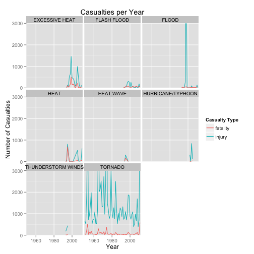
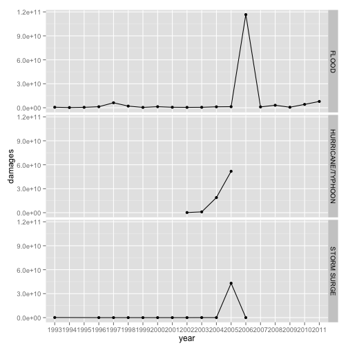

An Analysis of Public Health and Economic Effects of Inclement Weather Events
========================================================
# Synopsis
This analysis answers the questions, "Across the United States, which types of weather events are most harmful with respect to population health?"; and "Across the United States, which types of events have the greatest economic consequences?". Harm with respect to population health is summarized by both number of injuries and number of fatalaties per calendar year. Economic consequences are summarized by the sum total of all damages per calendar year. We find that the EVtypes are inconsistently labeled, but that heat events factor significantly in fatalities, whereas weather with strong winds factor into injuries. Floods, storm surges, and hurricanes are responsible for most damages found in the data set.

# Requirements
This analysis depends on the following packages. If these are not present on 
your current R installation, please install them.

```r
library(ggplot2)
library(plyr)
library(scales)
```

# Data Processing
The raw data are available in bzip2 format at `https://d396qusza40orc.cloudfront.net/repdata%2Fdata%2FStormData.csv.bz2`. This analysis assumes the data are already downloaded and located in the current working directory under the name `repdata%2Fdata%2FStormData.csv.bz2`. The data are then read in:

```r
# Be patient; this may take a couple of minutes

stormData <- read.csv(bzfile("./repdata%2Fdata%2FStormData.csv.bz2"))
```

We transform the data to ensure that they are of types conducive to our analysis; this means converting the `BGN_DATE` value to a Date object, and adding a `year` column for aggregating the data.

```r
stormData$BGN_DATE <- as.Date(stormData$BGN_DATE, format = "%m/%d/%Y %H:%M:%S")
stormData <- mutate(stormData, year = format(stormData$BGN_DATE, "%Y"))
```

Next, a data frame is created which analyzes information related only to public health. These data are transformed for further analysis by grouping the observations by event type and year, and taking the sum of all fatalities and injuries.

```r
# create the health data frame
phData <- ddply(stormData, c("EVTYPE", "year"), function(df) cbind(fatalities = sum(df$FATALITIES), 
    injuries = sum(df$INJURIES)))
```

The econ data frame is a little trickier, due to the way the data is encoded. The data are stored as a 3-digit number followed by an order of magnitude: either "K" for thousands, "M" for Millions, or "B" for Billions of dollars. To convert any pair of numbers and magnitudes to a single numeric, we use the following vectorized wrapper function:

```r
DmgMult <- function(x, mag) {
    x <- as.numeric(x)
    mag <- switch(as.character(mag), K = 10^3, M = 10^6, B = 10^9, 0)
    x * mag
}
vDmgMult <- Vectorize(DmgMult)
```

Using vDmgMult, we can now create the econ data frame, performing the same manipulations as on the public health data frame.

```r
econData <- ddply(stormData, c("EVTYPE", "year"), function(df) cbind(damages = sum(vDmgMult(df$PROPDMG, 
    df$PROPDMGEXP) + vDmgMult(df$CROPDMG, df$CROPDMGEXP))))

```


# Results
## Public Health Effects
First, we examine the data by creating a maximum likelihood estimate for injury and death due to each event type per calendar year; due to the high dimensionality of the data, we will examine only the top 5 contributors to death and injury.

```r
healthSummary <- ddply(phData, "EVTYPE", function(df) cbind(injuries_MLE = mean(df$injuries), 
    injuries_STD = sqrt(var(df$injuries)), fatalities_MLE = mean(df$fatalities), 
    fatalities_STD = sqrt(var(df$fatalities))))

top5Injury <- healthSummary[order(healthSummary$injuries_MLE, decreasing = TRUE)[1:5], 
    ]
top5Death <- healthSummary[order(healthSummary$fatalities_MLE, decreasing = TRUE)[1:5], 
    ]
causes <- union(top5Injury$EVTYPE, top5Death$EVTYPE)

ggplot(phData[phData$EVTYPE %in% causes, ], aes(year, injuries, group = EVTYPE, 
    color = "injury")) + geom_line() + geom_line(data = phData[phData$EVTYPE %in% 
    causes, ], aes(year, fatalities, group = EVTYPE, color = "fatality")) + 
    facet_wrap("EVTYPE", ncol = 3) + coord_cartesian(ylim = c(0, 3000)) + scale_x_discrete(breaks = pretty_breaks(n = 4)) + 
    labs(x = "Year", y = "Number of Casualties", color = "Casualty Type", title = "Casualties per Year")
```

 

```r
healthSummary[healthSummary$EVTYPE %in% top5Injury$EVTYPE, c(1, 2, 3)]
```

```
##                 EVTYPE injuries_MLE injuries_STD
## 130     EXCESSIVE HEAT        362.5        381.1
## 170              FLOOD        357.3       1399.6
## 411  HURRICANE/TYPHOON        318.8        370.3
## 786 THUNDERSTORM WINDS        302.7        132.6
## 834            TORNADO       1473.3       1313.2
```

```r
healthSummary[healthSummary$EVTYPE %in% top5Death$EVTYPE, c(1, 4, 5)]
```

```
##             EVTYPE fatalities_MLE fatalities_STD
## 130 EXCESSIVE HEAT         105.72         120.69
## 153    FLASH FLOOD          51.47          20.89
## 275           HEAT          72.08         185.86
## 278      HEAT WAVE          57.33          89.95
## 834        TORNADO          90.85         106.28
```


## Economic Effects
Now, we turn our attention to the economic effects of weather events. Similarly, we create a maximum likelihood estimate of the cost from each event type per calendar year:

```r
econSummary <- ddply(econData, "EVTYPE", function(df) cbind(dmg_MLE = mean(df$damages), 
    dmg_STD = sqrt(var(df$damages))))
top3Dmg <- econSummary[order(econSummary$dmg_MLE, decreasing = TRUE)[1:3], ]
ggplot(econData[econData$EVTYPE %in% top3Dmg$EVTYPE, ], aes(year, damages, group = EVTYPE)) + 
    geom_line() + facet_grid(EVTYPE ~ .) + geom_point()
```

 

```r
econSummary[econSummary$EVTYPE %in% top3Dmg$EVTYPE, ]
```

```
##                EVTYPE   dmg_MLE   dmg_STD
## 170             FLOOD 7.912e+09 2.641e+10
## 411 HURRICANE/TYPHOON 1.798e+10 2.415e+10
## 670       STORM SURGE 3.610e+09 1.242e+10
```

# Discussion
We find that damage reporting is very poor except for Flood, and that casualty reports are likewise wanting except in the case of Tornadoes. This is largely due to the presence of several categories which refer to the same or nearly the same concepts. In terms of the effect to public health, heat is the biggest killer; in various forms, heat is present in 3 of the top 5 causes of mortality. Heat is also present in the top 5 causes of injury, in addition to hurricanes, tornadoes, floods, and thunderstorms.

We find that floods and storm surges make up 2 of the 3 most damagin economic events. We see a similar issue with reporting of event types; this could be solved with a meta-analysis to pool event types with similar labels. In all results, the standard deviation is quite large, within an order of magnitude of the mean. This large amount of variation indicates that predictions made from the data should be interpreted cautiously. Further analyses are required to draw more robust conclusions.
